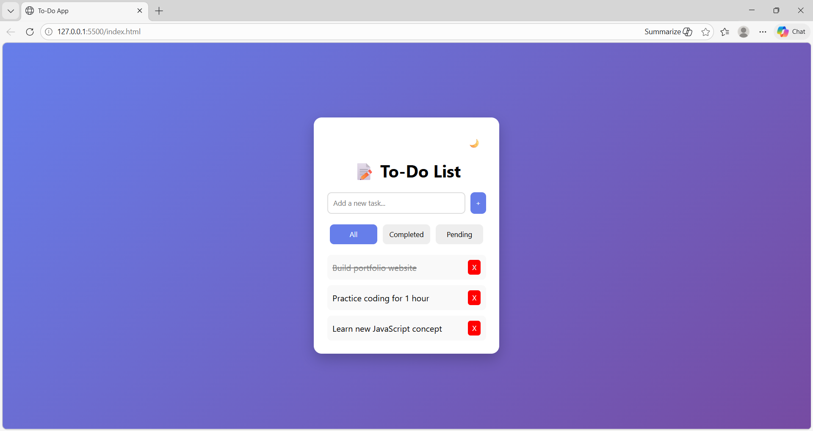

📝 To-Do List Web App

A modern and interactive To-Do List application built using HTML, CSS, and JavaScript. This app allows users to manage their daily tasks efficiently with a clean UI and smooth user experience.

🚀 Features

- ➕ Add new tasks
- ❌ Delete tasks with animation
- ✅ Mark tasks as completed
- 🔍 Filter tasks (All / Completed / Pending)
- 🌙 Dark mode toggle
- 💾 Data persistence using Local Storage
- ✨ Smooth animations and transitions

🛠️ Tech Stack

- HTML
- CSS
- JavaScript
- Local Storage

📸 Screenshot

📌 How to Run Locally

1. Clone the repository
2. Open the project folder
3. Open "index.html" in your browser

🙌 Acknowledgement

This project was built as part of a Udemy course to practice DOM manipulation and frontend development skills.
